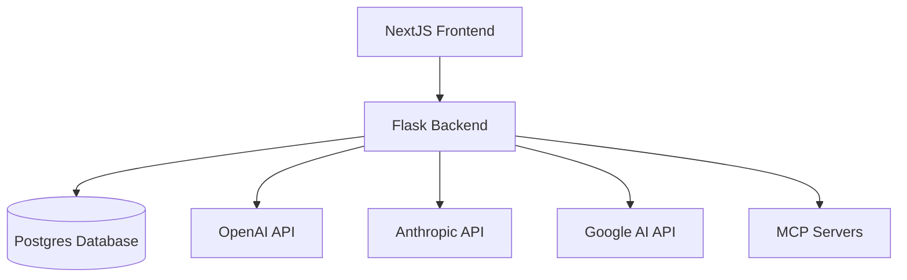
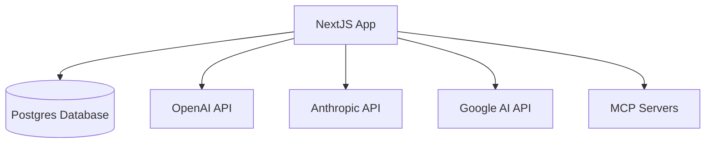
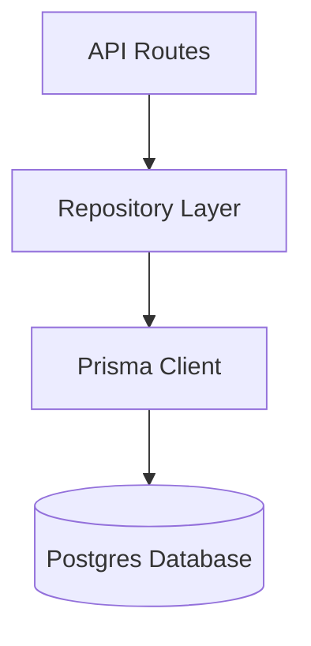
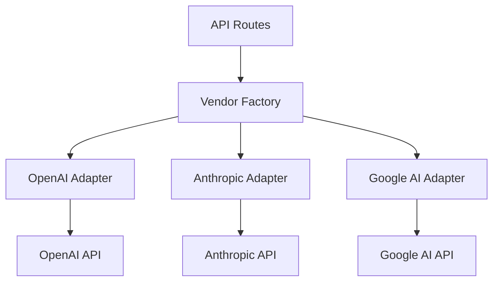
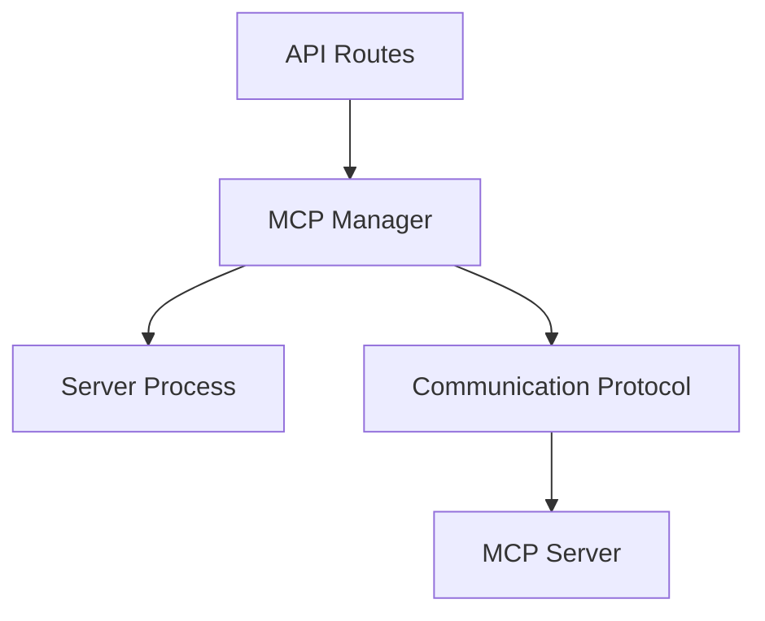

# Snowgoose Overhaul Plan: Flask to NextJS Migration

## Overview

This document outlines the comprehensive plan for migrating the Flask backend functionality into the NextJS application. The goal is to streamline the architecture by incorporating all functionality into the NextJS app while maintaining existing features and data.

## Current Architecture



## Target Architecture



## Core Principles

1. **Incremental Implementation**: Build new functionality alongside existing code
2. **Minimal Frontend Changes**: Keep frontend changes to a minimum
3. **Database Compatibility**: Ensure compatibility with the existing database schema
4. **API Consistency**: Maintain the same API responses for frontend compatibility
5. **Vendor Abstraction**: Create a flexible architecture for easy addition of new AI vendors

## Completed Phases

### Phase 1: Database Integration

**Task 1.1: Set up Prisma ORM**

- Install Prisma and related dependencies
- Create Prisma schema based on existing SQLAlchemy models
- Set up database connection configuration

**Task 1.2: Define Prisma Models**

- Create model definitions for all existing database tables
- Implement relationships between models
- Add appropriate indexes and constraints

**Task 1.3: Database Migration**

- Create migration scripts for existing data
- Test migrations in development environment
- Validate data integrity after migration

### Phase 2: API Layer Implementation

**Task 2.1: Create API Route Structure**

- Set up Next.js API routes mirroring current Flask endpoints
- Implement route handlers with appropriate HTTP methods
- Add authentication middleware

**Task 2.2: Implement Authentication**

- Create Clerk integration for API routes
- Implement token validation
- Set up user session management

**Task 2.3: Implement CRUD Operations**

- Create handlers for all entity types (Personas, Models, OutputFormats, etc.)
- Implement proper error handling
- Add validation using Zod schemas

### Phase 3: AI Vendor Integration

**Task 3.1: Create Vendor Abstraction Layer**

- Design interface for AI vendor implementations
- Create base classes for common functionality
- Implement vendor-specific adapters

**Task 3.2: Implement OpenAI Integration**

- Create OpenAI client wrapper
- Implement text completion functionality
- Implement image generation functionality
- Add vision capabilities

**Task 3.3: Implement Anthropic Integration**

- Create Anthropic client wrapper
- Implement Claude API integration
- Add thinking mode support
- Implement content block handling

**Task 3.4: Implement Google AI Integration**

- Create Google AI client wrapper
- Implement Gemini API integration
- Add thinking mode support

**Task 3.5: Create Vendor Factory**

- Implement factory pattern for vendor selection
- Add configuration for vendor-specific settings
- Create unified response format

## In Progress Phases

### Phase 4: Transition from Flask API to API Routes

**Task 4.1: Change old endpoints in api.ts to use new api routes**

## Technical Architecture

### Database Layer



The database layer will use Prisma as the ORM, providing a type-safe interface to the Postgres database. The repository pattern will abstract database operations and provide a clean API for the application.

### AI Vendor Integration



The vendor integration layer uses the adapter pattern to provide a consistent interface while handling vendor-specific implementations. The factory pattern enables easy selection of the appropriate vendor.

### MCP Server Integration



MCP server management handles server lifecycle and communication through a standardized protocol.

## Code Structure

```
/app
  /_lib
    /db
      /models       # Prisma models
      /repositories # Database access layer
      /migrations   # Database migrations
    /ai
      /vendors      # Vendor implementations
      /factory.ts   # Vendor factory
      /types.ts     # Common types
    /mcp
      /manager.ts   # MCP server management
      /protocol.ts  # Communication protocol
  /api              # API routes
    /personas
    /models
    /output-formats
    /chat
    /history
    /mcp-tools
```

## Key Considerations

1. **Data Safety**

   - Backup all data before migration
   - Maintain data integrity during transition
   - Validate data after migration

2. **Performance**

   - Monitor response times
   - Optimize database queries
   - Implement caching where appropriate

3. **Error Handling**

   - Implement comprehensive error handling
   - Add logging and monitoring
   - Create recovery procedures

4. **Security**

   - Maintain secure authentication
   - Protect sensitive data
   - Implement rate limiting

5. **Testing**
   - Create comprehensive test suite
   - Test all edge cases
   - Validate vendor integrations

## Success Criteria

1. All existing functionality is preserved
2. Database operations maintain data integrity
3. API responses match current format
4. Performance meets or exceeds current metrics
5. All AI vendor integrations function correctly
