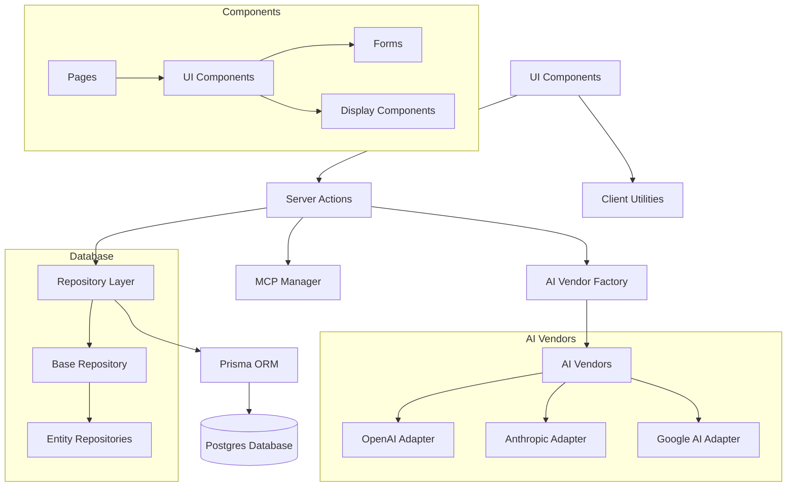
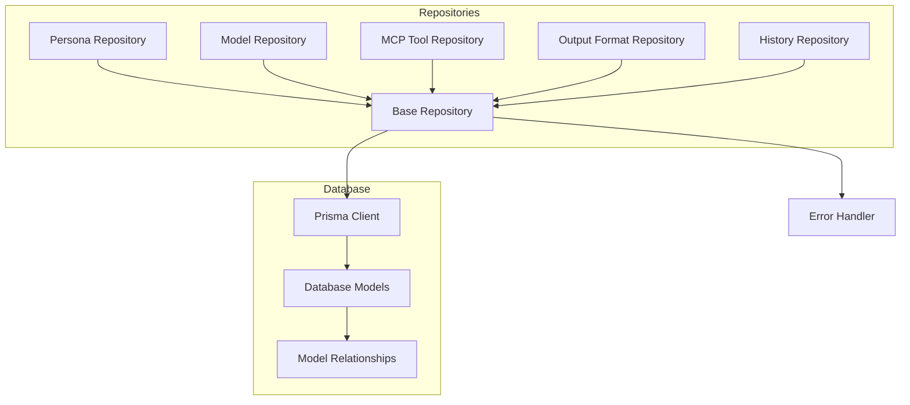
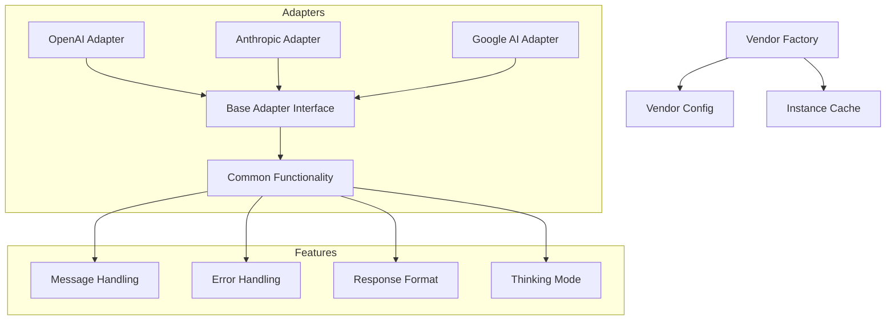
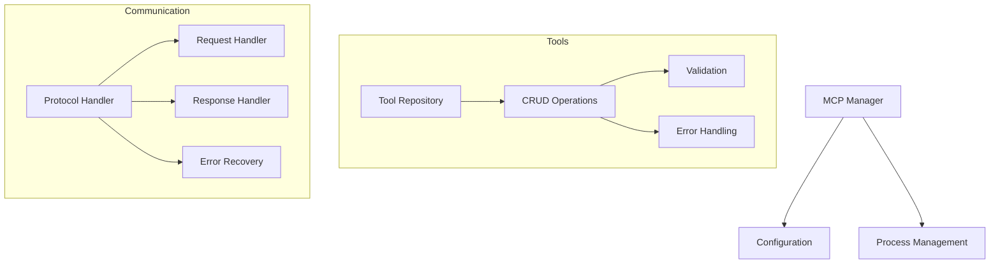

# System Patterns

## Architecture Overview

### System Architecture (Next.js 14)

## Key Design Patterns

### 1. Component Organization

- **\_ui/**: Reusable UI components
  - Form components with validation
  - Display components for responses
  - Settings management interfaces
  - Common UI utilities
- **\_lib/**: Shared utilities and business logic
  - **/db**: Database models and repositories
  - **/ai**: AI vendor implementations
  - **/mcp**: MCP server management
  - **/server_actions**: Server action business logic for interfacing with repositories
  - Form schemas and validation
- **mcp_servers/** Storage of MCP servers

### 2. Data Flow

- Repository pattern for database operations
  - Base repository with common operations
  - Entity-specific repositories
  - Transaction handling
  - Error standardization
- Server Actions for data mutations
  - Form handling
  - Data validation
  - Error handling
  - Response formatting
- Vendor adapter pattern for AI services
  - Common interface
  - Vendor-specific implementations
  - Factory pattern for instantiation
  - Response standardization

### 3. Feature Organization

- Feature-based directory structure
- Shared components in \_ui directory
- Provider-specific logic isolated in adapters
- Settings management separated by domain
- API routes aligned with features

### 4. State Management

- Form state handled by React Hook Form
- Server state managed through Server Actions
- UI state managed locally in components
- Authentication state via hosted Supabase
- Database state via Prisma

### 5. Error Handling

- **Server Action Pattern:**
  - `catch` blocks in Server Actions log the full error details server-side using `console.error(error)`.
  - A new, generic `Error("User-friendly message")` is then thrown to prevent leaking implementation details to the client boundary.
  - The `BaseRepository.handleError` method now simply re-throws the original error, allowing the Server Action layer to handle logging and user-facing message generation.
  - For actions using `useFormState` (like `updateUserPassword`), the `handleServerError` utility in `app/_lib/utils.ts` is used to return a structured `FormState` object containing either validation errors (`fieldErrors`) or a generic `error` message.
- Standardized error responses (primarily through generic thrown errors or `FormState`).
- Type-safe error handling (e.g., checking for `ZodError` in `handleServerError`).
- Recovery mechanisms (e.g., allowing chat to proceed if auxiliary data fetching fails).
- Transaction management (handled within repositories where applicable).

## Component Relationships

### Repository Pattern

### AI Vendor Integration

### MCP Integration

## Technical Patterns

### 1. Form Handling

- React Hook Form for state management
- Zod schemas for validation
- Server-side validation
- Error message standardization
- Field-level validation

### 2. Database Operations

- Repository pattern abstraction
- Prisma for type-safe queries
- Transaction management
- Error handling standardization
- Connection pooling

### 3. AI Integration

- Vendor adapter pattern
- Factory pattern for instantiation
- Response standardization
- Error handling middleware
- Message formatting

### 4. Authentication

- Supabase integration
- Protected routes
- Session management
- Role-based access
- User context

### 5. UI Patterns

- Component composition
- Progressive enhancement
- Responsive design
- Loading states
- Error boundaries
- Toast notifications (`sonner`)

### 6. MCP Integration

- Tool management
- Process lifecycle
- Environment handling
- Error recovery
- Communication protocol
