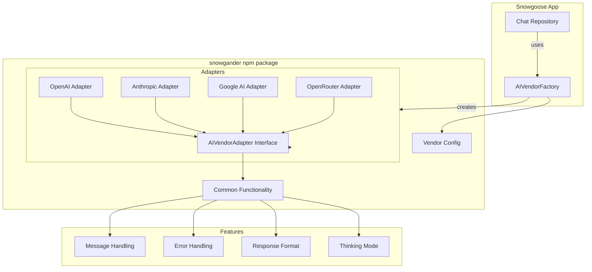
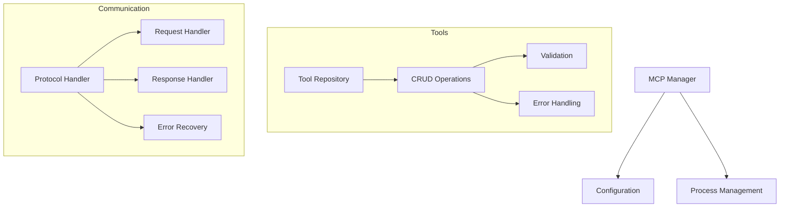

# System Patterns

## Architecture Overview

### System Architecture (Next.js 14)

````mermaid
flowchart TD
    UI[UI Components] --> Actions[Server Actions]
    UI --> ClientUtils[Client Utilities]
    Actions --> Repositories[Repository Layer]
    Repositories --> Prisma[Prisma ORM]
    Prisma --> DB[(Postgres Database)]
    Actions --> ChatRepo[Chat Repository]
    ChatRepo --> AIFactory["snowgander <br> AIVendorFactory"]
    AIFactory --> AIVendors["snowgander <br> Adapters"]
    Actions --> MCPManager[MCP Manager]
    Actions --> StripeActions[Stripe Actions]
    StripeActions --> StripeAPI[Stripe API]
    StripeAPI -- Webhook Event --> StripeWebhookRoute[API Route: /api/webhooks/stripe]
    StripeWebhookRoute --> Repositories

    subgraph Components
        Pages[Pages] --> UIComponents[UI Components]
        UIComponents --> Forms[Forms]
        UIComponents --> Display[Display Components]
    end

    %% AI Vendors subgraph removed as it's now part of the package %%

    subgraph Database
        Repositories --> BaseRepo[Base Repository]
        BaseRepo --> EntityRepos[Entity Repositories]
    end

### Deployment Architecture (Docker + Fly.io)

```mermaid
graph TD
    subgraph Local Development
        Dev[Developer Machine] -- docker compose up --> DevCompose[docker-compose.yml]
        DevCompose --> DevApp[App Container (Node.js)]
        DevCompose --> DevDB[DB Container (Postgres)]
        DevApp <--> DevDB
        DevApp -- volume mount --> Codebase[/Users/tharris/Code/snowgoose]
    end

    subgraph Production Deployment (Fly.io)
        CI/CD{CI/CD Pipeline (Optional)} -- triggers --> Build[Docker Build (Multi-stage)]
        Build -- pushes image --> Registry[Container Registry (e.g., Fly Registry)]
        Fly[Fly Platform] -- deploys --> ProdApp[App Container (Fly Machine)]
        Fly -- deploys --> ProdDB[DB Container (Fly Postgres)]
        ProdApp <--> ProdDB
        Registry -- image --> ProdApp
        User[User Browser] --> ProdApp
        DevOps[Developer/Admin] -- flyctl deploy --> Fly
        DevOps -- fly secrets set --> Fly[Fly Secrets]
        Fly --> ProdApp[Injects Secrets as ENV VARS]
    end

    Build -- uses --> Dockerfile[Dockerfile]
    Fly -- uses --> FlyToml[fly.toml]
    Fly -- uses --> ProdCompose[docker-compose.prod.yml (Reference for services/env)]

````

## Key Design Patterns

### 1. Component Organization

- **\_ui/**: Reusable UI components
  - Form components with validation
  - Display components for responses
  - Settings management interfaces
  - Common UI utilities
- **\_lib/**: Shared utilities and business logic within the main app
  - **/db**: Database models and repositories
    // - **/ai**: AI vendor implementations (Moved to standalone package)
  - **/mcp**: MCP server management
  - **/server_actions**: Server action business logic for interfacing with repositories
    - **stripe.actions.ts**: Stripe checkout session creation
  - Form schemas and validation
  # Note: AI vendor logic is now in the standalone 'snowgander' npm package (v0.0.17)
- **mcp_servers/** Storage of MCP servers
- **app/subscriptions/** Subscription management pages (`page.tsx`)
- **app/success/** Subscription confirmation page (`page.tsx`)
- **app/api/webhooks/stripe/** Stripe webhook handler (`route.ts`)

### 2. Data Flow

- Repository pattern for database operations
  - Base repository with common operations
  - Entity-specific repositories
  - Transaction handling
  - Error standardization
- Server Actions for data mutations
  - Form handling
  - Data validation
  - Error handling
  - Response formatting
- Vendor adapter pattern for AI services
  - Common interface
  - Vendor-specific implementations
  - Factory pattern for instantiation
  - Response standardization

### 3. Feature Organization

- Feature-based directory structure
- Shared components in \_ui directory
- Provider-specific logic isolated in adapters
- Settings management separated by domain
- API routes aligned with features

### 4. State Management

- Form state handled by React Hook Form
- Server state managed through Server Actions
- UI state managed locally in components
- Authentication state via hosted Supabase
- Database state via Prisma

### 5. Error Handling

- **Server Action Pattern:**
  - `catch` blocks in Server Actions log the full error details server-side using `console.error(error)`.
  - A new, generic `Error("User-friendly message")` is then thrown to prevent leaking implementation details to the client boundary.
  - The `BaseRepository.handleError` method now simply re-throws the original error, allowing the Server Action layer to handle logging and user-facing message generation.
  - For actions using `useFormState` (like `updateUserPassword`), the `handleServerError` utility in `app/_lib/utils.ts` is used to return a structured `FormState` object containing either validation errors (`fieldErrors`) or a generic `error` message.
- Standardized error responses (primarily through generic thrown errors or `FormState`).
- Type-safe error handling (e.g., checking for `ZodError` in `handleServerError`).
- Recovery mechanisms (e.g., allowing chat to proceed if auxiliary data fetching fails).
- Transaction management (handled within repositories where applicable).

## Component Relationships

### Repository Pattern

```mermaid
flowchart TD
    BaseRepo[Base Repository] --> PrismaClient[Prisma Client]
    BaseRepo --> ErrorHandler[Error Handler]

    subgraph Repositories
        PersonaRepo[Persona Repository] --> BaseRepo
        ModelRepo[Model Repository] --> BaseRepo
        MCPToolRepo[MCP Tool Repository] --> BaseRepo
        OutputFormatRepo[Output Format Repository] --> BaseRepo
        HistoryRepo[History Repository] --> BaseRepo
    end

    subgraph Database
        PrismaClient --> Models[Database Models]
        Models --> Relationships[Model Relationships]
    end
```

### AI Vendor Integration



### Subscription Integration

```mermaid
flowchart TD
    subgraph "User Flow (Browser)"
        User[User Browser] --> SubPage["/subscriptions <br> (page.tsx)"]
        SubPage -- Selects Plan & Submits Form --> CheckoutAction["stripe.actions.ts <br> (createCheckoutSessionAction)"]
        CheckoutAction -- Redirects --> StripeHostedCheckout[Stripe Hosted Checkout Page]
        StripeHostedCheckout -- Success --> SuccessPage["/success <br> (page.tsx)"]
        SuccessPage --> AppAccess[App Access (Future Check)]
    end

    subgraph "Backend Logic (Server)"
        style Backend fill:#e6f7ff,stroke:#333,stroke-width:1px
        SubPage -- Calls --> GetPlansAction["stripe.actions.ts <br> (getSubscriptionPlans)"]
        GetPlansAction --> StripeAPI[Stripe API]

        CheckoutAction -- Gets User Auth ID --> AuthHelper["auth.ts <br> (getUserSession)"]
        CheckoutAction -- Creates Session --> StripeAPI
        StripeAPI -- Sends Event --> WebhookRoute["/api/webhooks/stripe <br> (route.ts)"]
        WebhookRoute -- Verifies & Parses --> StripeAPI
        WebhookRoute -- Updates User --> UserRepo["user.repository.ts <br> (updateSubscriptionByAuthId, <br> updateSubscriptionByCustomerId, <br> clearSubscriptionByCustomerId)"]
        UserRepo -- Reads/Writes --> PrismaClient[Prisma Client]
        PrismaClient --> UserTable[(Database: User Table <br> incl. periodUsage)]
        PrismaClient --> PlanTable[(Database: SubscriptionPlan Table <br> incl. usageLimit)]

        %% Usage Check Logic (Conceptual - happens before billable actions) %%
        style UsageCheck fill:#f9f,stroke:#333,stroke-width:1px
        BillableAction["Server Action <br> (e.g., Chat)"] -- Needs Limit Check --> UserRepo
        UserRepo -- Reads --> UserTable
        UserRepo -- Reads --> PlanTable
        BillableAction -- Proceeds or Blocks --> User

        %% Usage Reset Logic (Inside UserRepository) %%
        UserRepo -- "customer.subscription.updated event" --> ResetCheck{Compare Period Start?}
        ResetCheck -- Yes --> UpdateUsage["Update User: <br> periodUsage = 0"]
        UpdateUsage --> UserTable
        ResetCheck -- No --> NoReset[No Usage Reset]


        AppAccess -- Needs Check --> UserRepo["user.repository.ts <br> (findByAuthId or similar)"]
        UserRepo --> UserTable
    end

    subgraph "External Services"
        StripeAPI
        StripeHostedCheckout
    end
```

### MCP Integration



## Technical Patterns

### 1. Form Handling

- React Hook Form for state management
- Zod schemas for validation
- Server-side validation
- Error message standardization
- Field-level validation

### 2. Database Operations

- Repository pattern abstraction
- Prisma for type-safe queries
- Transaction management
- Error handling standardization
- Connection pooling

### 3. AI Integration

- Vendor adapter pattern
- Factory pattern for instantiation
- Response standardization
- Error handling middleware
- Message formatting

### 4. Authentication

- Supabase integration
- Protected routes
- Session management
- Role-based access
- User context

### 5. UI Patterns

- Component composition
- Progressive enhancement
- Responsive design
- Loading states
- Error boundaries
- Toast notifications (`sonner`)

### 6. MCP Integration

- Tool management
- Process lifecycle
- Environment handling
- Error recovery
- Communication protocol
