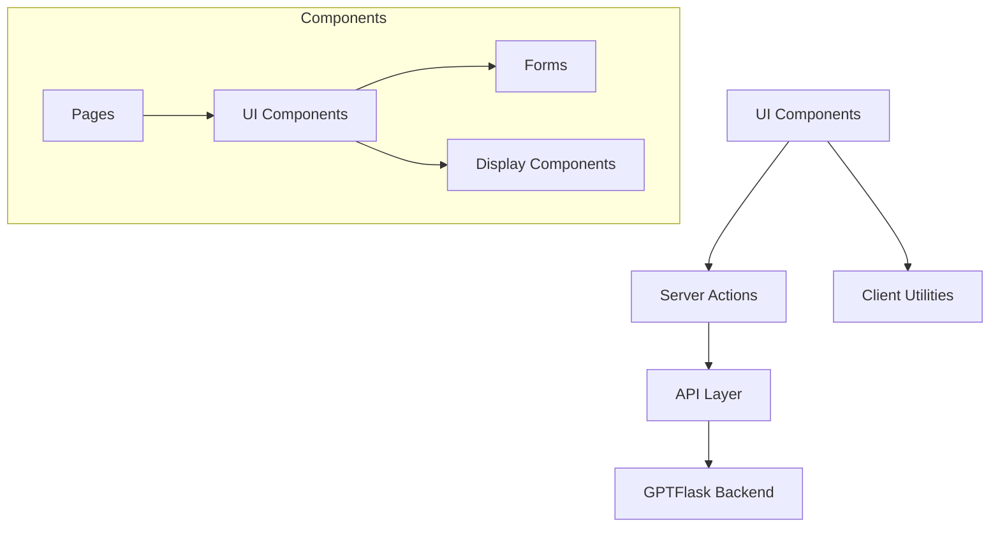
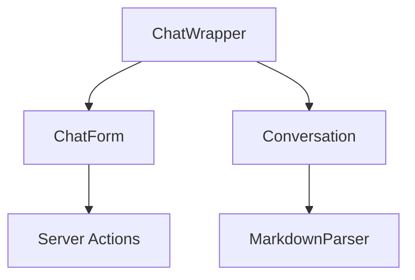
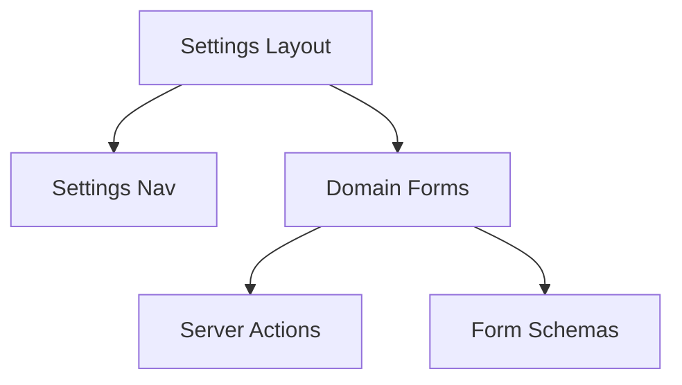

# System Patterns

## Architecture Overview

### Frontend Architecture (Next.js 14)

## Key Design Patterns

### 1. Component Organization

- **\_ui/**: Reusable UI components
- **\_lib/**: Shared utilities and business logic
- **settings/**: Configuration and management interfaces
- Layout components for consistent structure

### 2. Data Flow

- Server Actions for data mutations
- API layer for external communication
- Client-side utilities for UI state management
- Form schemas for validation

### 3. Feature Organization

- Feature-based directory structure
- Shared components in \_ui directory
- Provider-specific logic isolated in API layer
- Settings management separated by domain

### 4. State Management

- Form state handled by React Hook Form
- Server state managed through Server Actions
- UI state managed locally in components
- Authentication state via Clerk

### 5. Error Handling

- Graceful degradation
- User-friendly error messages
- API error standardization
- Recovery mechanisms

## Component Relationships

### Chat Interface

### Settings Management

## Technical Patterns

### 1. Form Handling

- React Hook Form for form state
- Zod for schema validation
- Server-side validation
- Error message standardization

### 2. API Integration

- Typed API responses
- Error handling middleware
- Request/response interceptors
- Provider-specific adapters

### 3. Authentication

- Clerk integration
- Protected routes
- Role-based access
- Session management

### 4. UI Patterns

- Responsive design
- Progressive enhancement
- Accessibility standards
- Loading states
